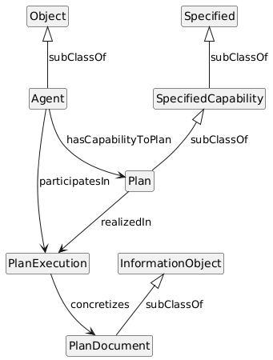

# Discussion about how to model the concept of a plan

## Why is this necessary

Planning is integral to business operations. A plan is a conceptualisation of a future series of actions that will achieve a goal. Plans must be executed in order to achieve the goal. Plans are documented but the documentation is not the plan.

The Oxford English Dictionary describes plan as follows:

An organised (and usually detailed) proposal according to which something is to be done; a strategy; a programme, schedule. Also in weakened sense: a method or way of proceeding; an intention or ambition for the future (usually in plural).

There are other definitions relating to plan design drawings etc but these are not relevant to this conversation.

A plan can be considered a superclass for a number of operations in an industrial enterprise that involves consideration of a sequence of actions to be performed at some future time to achieve a goal. For example, a schedule, a strategy, a procedure.

Having a pattern for how to model this concept will assist groups in the IDO to be consistent.

## Pattern proposal

See Figure

