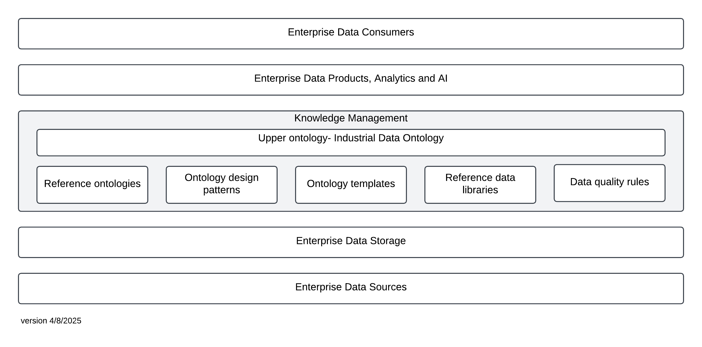
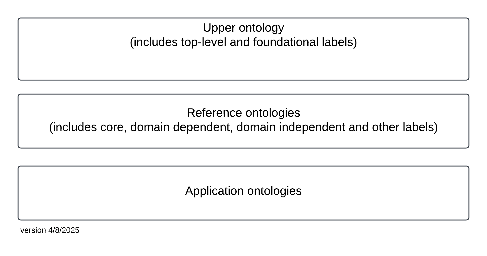

### Lead authors: Melinda Hodkiewicz and Andreas Neumann

#### Development team: Pål Rylandsholm, Maja Milicic Brandt, Johan W Kluwer, Caitlin Woods, Dirk Walter, Inghild Kaarstad

### Abstract
This document provides guidance to industry users and the semantic data modelling community on 1) the vision for the ISO 23726 Ontology-based Interoperability (OBI) series, and 2) a set of principles which resources will have to comply with in order to be considered `compliant` with IDO and the ISO 23726 series. The [Industrial Data Ontology (IDO)](https://rds.posccaesar.org/ontology/lis14/) is the upper ontology in the ISO 23726 series. IDO is currently inside the ISO process and due to be published as an ISO standard in 2026.  
  
The contents of this document will be submitted to ISO as part of ISO 23726-1 in October 2025. The standardisation process is expected to take 3 years. During this period the contents of this document will evolve as other organisations and national bodies work to shape the ideas presented in this initial version. Once inside the ISO process only members of the ISO TC184/SC4 WG26 committee and the liaison groups will have access to the draft standard and any associated digital artefacts until it is published in 2027/2028. 

### Licence
[CC-BY-SA-4.0 licence](https://creativecommons.org/licenses/by-sa/4.0/)

## Ontology-based Interoperability for Industrial Data

## Introduction
Machine-interpretable data are a key enabler of 1) industrial automation, and 2) the application of artificial intelligence to products, plants, processes, and services. However, organizational data are often stored in digital formats that use proprietary terms, definitions, and schemas. This lack of [semantic interoperability](#90902_id-14833992-ad1e-4e12-fcbd-31b74aab0be9) means that data exchange frequently relies on manual interpretation or custom mappings. Documents such as engineering standards, procedures, spreadsheets, and reference data libraries are prone to misinterpretation when their semantics are not formally and explicitly defined.
A semantically explicit format is key to human and machine interoperability. An ontology is a structured set of terms, their interrelationships, and associated definitions, supported by formal logic to ensure that the intended meaning is unambiguous and machine-interpretable. The use of formal representation enables consistent preservation and exchange of meaning.
Ontologies are increasingly integrated into enterprise architecture, particularly within knowledge management layers. An example is shown in Figure 1. The Ontology-Based interoperability (OBI) ecosystem comprises artefacts managed by ISO 23726 WG26, external organizations, enterprises, as well as organizational stakeholders, processes, and capabilities.
  
Figure 1 — Example of enterprise architecture for OBI ontology-based interoperability

At the base of the Figure 1 is a level representing the data sources created by enterprises and stored in the data storage system layer. To organize, check, and integrate data from disparate source systems, organisations are incorporating a knowledge management layer into their enterprise architecture. An ontology-based knowledge management layer provides quality controlled, interoperable data for data products, analytics and AI used by data consumers within and across organisations. IDO is the [upper ontology](#90902_id-a2afc511-994c-4a84-8aa1-4d8e28292229) in the [OBI ecosystem](#90902_id-a818dabf-317e-4318-a9b1-31ca624cc493) knowledge management layer. In addition to IDO the knowledge management layer includes [enterprise ontologies](#90902_id-25040f49-0155-4535-a64c-bd29075672fa) and shared artefacts such as reference ontologies, ontology modelling patterns, [templates](#90902_id-8babb47a-1a60-4a80-b2ff-7b03f9d5c926), [reference data libraries](#90902_id-94d8adaf-b5ac-475d-fa03-878c2eb37fdf), data quality rules, SHACL shapes, and SPARQL queries. Above the knowledge management layer sits in an enterprise architecture for [data products](#90902_id-cbf2491c-8def-4a9e-bc12-0c1929d85096), data analytics and artificial intelligence models which are accessible to data consumers.
The W3C standards Web Ontology Language (OWL) and Resource Description Framework (RDF) are foundational standards for the [Semantic Web](#90902_id-4c838da8-8cf6-48ab-8b2f-47be27b44bda) and considered normative for ontologies in the Ontology based interoperability (OBI) standards. These standards enable machine -readable, semantically interoperable representations based on shared vocabularies and logical structures. The foundation for the OBI series is ISO 23726-3, the Industrial Data Ontology (IDO).
IDO specifies an abstract representation of the industrial data domain, including a high level of conceptual abstraction and associated modelling constraints. The semantic interpretation of a concept modelled according to an IDO-aligned artefact is explicitly defined. This enables consistent interpretation and automated reasoning by both humans and machines.
IDO is implemented as an OWL 2 [upper ontology](#90902_id-a2afc511-994c-4a84-8aa1-4d8e28292229). OWL 2 DL ontologies are interpreted using the Direct Semantics. DL ([description logics](#90902_id-dbf73766-faeb-4a8c-ffc8-71e66fb154da)) are a family of languages used in artificial intelligence and [Semantic Web](#90902_id-4c838da8-8cf6-48ab-8b2f-47be27b44bda) technologies for logic-based knowledge representation and reasoning. Typical [ontology reasoning](#90902_id-75768bd8-00ef-4c11-a67a-8e2dd8d9566e) tasks include: (1) consistency checking, (2) automated classification (i.e. inferring implicit subclass hierarchies), and (3) derivation of implicit facts. OWL DL reasoners are software systems that perform these reasoning tasks automatically. Such automated reasoning is essential for quality assurance, semantic consistency, and knowledge inference within ontologies.

## 1 Scope
This draft provides an overview and the fundamental principles of the multipart standard ISO 23726 series _Industrial automation systems and integration – Ontology based interoperability (OBI)._
This draft specifies the principles for ontologies and artefacts aligned with IDO [upper ontology](#90902_id-a2afc511-994c-4a84-8aa1-4d8e28292229) to be considered part of the OBI series.
This draft is applicable for the representation of engineering data associated with all phases of the life cycle of industrial products, plants and systems to enable [semantic interoperability](#90902_id-14833992-ad1e-4e12-fcbd-31b74aab0be9).
The following are outside the scope of this draft:
  1. specification of ontology languages.
  2. specification of [Semantic Web](#90902_id-4c838da8-8cf6-48ab-8b2f-47be27b44bda) standards such as Resource Description Framework (RDF), SHACL, SPARQL, and [Internationalized Resource Identifiers](#90902_id-fe088aab-9638-49db-e45b-316b4f274a11) (IRIs).
  3. specification of methods for reasoning with ontologies.
  4. Methods to build, maintain, align, and evaluate ontologies and artefacts to meet the principles in this draft. These will be covered in separate guideline drafts.

## 2 Normative references
There are no normative references.

## 3 Terms and definitions

### 3.1 Types of ontologies

 

#### 3.1.1
application ontology
ontology developed for a particular task or [use case (3.3.6)](#90902_id-52907548-af05-4df7-819b-16eb3c223620) that contains only the concepts, relationships, and constraints necessary for the context
Note 1 to entry: Designed to be used in a specific context and are not always reusable.

 

#### 3.1.2
enterprise ontology
ontology developed, owned, and maintained by an enterprise
Note 1 to entry: Enterprise ontologies include [reference ontologies (3.1.3)](#90902_id-996eca6e-ae2b-4f5b-e84c-1638f3bd2914) and [application ontologies (3.1.1)](#90902_id-12ab04b2-4d7c-4789-ba9e-4791b2bf1baa).
Note 2 to entry: An [enterprise ontology (3.1.2)](#90902_id-25040f49-0155-4535-a64c-bd29075672fa) conceptualizes enterprise vocabulary and knowledge.
Note 3 to entry: An [enterprise ontology (3.1.2)](#90902_id-25040f49-0155-4535-a64c-bd29075672fa) is not an ontology for a specific software application or program.

 

#### 3.1.3
reference ontology
provides a shared, formal understanding of the concepts and relationships within a specific domain or field of knowledge
Note 1 to entry: Reference ontologies provide a common vocabulary and structure. They are reusable across multiple applications.
Note 2 to entry: Reference ontologies are stable and actively maintained.
Note 3 to entry: There is no agreement in the literature as to a naming convention for ontologies that sit between the [upper ontology (3.1.4)](#90902_id-a2afc511-994c-4a84-8aa1-4d8e28292229)and an [enterprise ontology (3.1.2)](#90902_id-25040f49-0155-4535-a64c-bd29075672fa). Various names such as Core, Domain, Domain-independent, Domain-dependent are used but not clearly defined. The term [reference ontology (3.1.3)](#90902_id-996eca6e-ae2b-4f5b-e84c-1638f3bd2914) is used in this standard as a label for all of these terms. [Application ontologies (3.1.1)](#90902_id-12ab04b2-4d7c-4789-ba9e-4791b2bf1baa) will usually import a number of reference ontologies from both within the enterprise and from trusted external groups such as ISO.

 

#### 3.1.4
upper ontology
top level ontology
defines abstract concepts and general relationships that are common across all domains
Note 1 to entry: Abstract concepts are things like Object, Event, Process, Role, Quality and Function and general relationships are relations such as lis:partOf, lis:participatesIn and lis:hasQuality

### 3.2 Ontology and RDF concepts

 

#### 3.2.1
axiom
logical statement that is taken to be true, to serve as a premise for further reasoning
Note 1 to entry: Axioms may be formulated as natural language sentences or as formulae in a formal language. In the OWL community, `[axiom (3.2.1)](#90902_id-f6f5d02c-8539-48dc-e037-64849b136806)’ is used to refer to statements that say what is true in the domain that are ‘basic’ in the sense that they are not inferred from other statements.
[SOURCE:ISO DIS 23726-3]

 

#### 3.2.2
annotation property
RDF property included in the vocabulary of an OWL ontology, with no semantic significance
Note 1 to entry: Annotation properties allow for [metadata (3.4.3)](#90902_id-5c183346-1414-49e8-be56-8dc3a60d704e) on entities in an ontology that is not subject to OWL reasoning.
Note 2 to entry: Annotation properties are used to add human-readable descriptions such as labels, definitions and notes.
Note 3 to entry: [https://www.w3.org/TR/owl2-syntax/#Annotation_Properties](https://www.w3.org/TR/owl2-syntax/#Annotation_Properties)
[SOURCE:ISO DIS 23726-3]

 

#### 3.2.3
class restriction
OWL class restriction
type of logical [axiom (3.2.1)](#90902_id-f6f5d02c-8539-48dc-e037-64849b136806) that constrain the properties and relationships of individuals within a class
Note 1 to entry: The main types of class restrictions in OWL ontologies (owl:Restriction) are existential (some), universal (only), value restriction (have a specific value for a property) and cardinality (have exactly, at least, or at most a certain number of relations).

 

#### 3.2.4
description logics
family of languages used in artificial intelligence and [Semantic Web (3.4.4)](#90902_id-4c838da8-8cf6-48ab-8b2f-47be27b44bda) technologies for logic-based knowledge representation and reasoning

 

#### 3.2.5
expressivity
level of expressivity
degree of complexity and richness in the types of knowledge an ontology can represent using its logical language
Note 1 to entry: Different aspects of [expressivity (3.2.5)](#90902_id-ae7ee2d0-70d6-44f3-9114-ac7793cd2b7c) include: 
  1. Conceptual - ability to define complex class descriptions, such as reification, intersection, union, complement, restriction, and equivalence.
  2. Property - ability to define object and data properties with characteristics such as transitivity, symmetry, inverse, and functionality.
  3. Axioms and constraints - ability to represent general class axioms, disjointness, property hierarchies, and cardinality constraints.

Note 2 to entry: More expressive ontologies allow deeper automated reasoning (e.g. classification, consistency checking) but may be computationally more expensive or even undecidable.

 

#### 3.2.6
ontological commitment
agreement to use the shared vocabulary in a coherent and consistent manner
Note 1 to entry: a commitment to an [upper ontology (3.1.4)](#90902_id-a2afc511-994c-4a84-8aa1-4d8e28292229) is a guarantee of consistency, but not completeness, with respect to queries and assertions using the vocabulary defined in the ontology   

Note 2 to entry: minimizing [ontological commitment (3.2.6)](#90902_id-98625d31-c4dd-4272-8204-817b4517dd53) means making as few claims as possible about the world being modelled.
[SOURCE:Gruber, Thomas R., and Gregory R. Olsen. "An ontology for engineering mathematics." In _Principles of Knowledge Representation and Reasoning_ , pp. 258-269. Morgan Kaufmann, 1994]

 

#### 3.2.7
ontology alignment
process of identifying relationships between concepts in two different ontologies
Note 1 to entry: There are three types of alignment: 
  1. equivalence - concepts are the same,
  2. subsumption - one concept is more general than the other,
  3. relatedness - concepts are related but not identical.

 

#### 3.2.8
ontology reasoning
OWL DL reasoning
inference of implicit facts from knowledge expressed in an OWL 2 ontology using the direct model theoretic semantics of OWL 2 DL

 

#### 3.2.9
semantic interoperability
interoperability so that the meaning of the data within the context of a subject area is understood by the participating systems
Note 1 to entry: Systems include pieces of equipment, software, human and computing systems.  

Note 2 to entry: This is accomplished by linking data elements to a controlled, shared vocabulary.
Note 3 to entry: Ensures that data from current and legacy systems, sensors, software tools and databases can be integrated and used without manual reconciliation or misunderstanding.
Note 4 to entry: A foundation for Industry 4.0, Smart Factories and Digital Product passports.
[SOURCE:ISO/IEC 19941:2017]

 

#### 3.2.10
shortcut property
object or datatype property in OWL intended as equivalent in meaning to a modelling [pattern (3.3.3)](#90902_id-375bcae2-7d95-4df7-ed03-626059f2b691) that would involve additional entities or classifications if made explicit
[SOURCE:ISO DIS 23726-3 Annex B]

### 3.3 Ontology elements

 

#### 3.3.1
competency question
question formulated in natural language that defines a formal requirement in the ontology engineering process
Note 1 to entry: Competency questions capture requirements from domain experts and check they can be addressed and guide developers in identifying what classes, properties, and constraints are needed.
Note 2 to entry: Competency questions allows a reasoner or query engine to produce a correct and complete answer to a question that the ontology was intended to support

 

#### 3.3.2
ontology module
subset of an ontology containing only the concepts and [axioms (3.2.1)](#90902_id-f6f5d02c-8539-48dc-e037-64849b136806) needed for a specific purpose or context
Note 1 to entry: An [ontology module (3.3.2)](#90902_id-f0a96969-59c0-45d2-f367-dcf0066267ea) is imported into other ontologies as a building block.
Note 2 to entry: An [ontology module (3.3.2)](#90902_id-f0a96969-59c0-45d2-f367-dcf0066267ea) is like the chapter or page of a book where the ontology is the whole book

 

#### 3.3.3
ontology pattern
pattern
reusable modelling solution in ontology development
Note 1 to entry: Used to streamline the design of an ontology or artefact by offering tried-and-tested solutions to recurring conceptualization challenges in a principled way to enable consistency, best practices, completeness, support of automation and simplification in communication.

 

#### 3.3.4
ontology template
template
means by which ontology models and modelling [patterns (3.3.3)](#90902_id-375bcae2-7d95-4df7-ed03-626059f2b691) can be instantiated transforming conceptual knowledge and instance data into an OWL/RDF serialization  

Note 1 to entry: Best practice is to map templates to the modelling patterns that they contribute to instantiating (noting that several templates are involved in the instantiation of one modelling [pattern (3.3.3)](#90902_id-375bcae2-7d95-4df7-ed03-626059f2b691)).

 

#### 3.3.5
reference data library
RDL
managed collection of reference data  
[SOURCE: ISO 15926-1:2004]
Note 1 to entry: IDO is intended to be a suitable basic vocabulary for Reference Data Libraries (RDL) represented as OWL 2 ontologies.  

Note 2 to entry: An [RDL (3.3.5)](#90902_id-94d8adaf-b5ac-475d-fa03-878c2eb37fdf) provides top-level categories, such as Object, Location, Activity, according to which [RDL (3.3.5)](#90902_id-94d8adaf-b5ac-475d-fa03-878c2eb37fdf) elements can be categorized.

 

#### 3.3.6
use case
technique for capturing potential functional requirements

### 3.4 General terms

 

#### 3.4.1
data product
rational, managed, and governed collection of data, with purpose, value and ownership, meeting consumer needs over a planned life-cycle
[SOURCE:Data Product Ontology [https://ekgf.github.io/dprod/](https://ekgf.github.io/dprod/)]

 

#### 3.4.2
internationalized resource identifier
IRI
unique sequence of characters from the Universal Character Set constructed according to the syntax rules provided in RFC 3987
Note 1 to entry: IRIs identify resources on the web in a way that supports a wide range of characters and languages enabling a more diverse representation of information, especially in languages other than English.
Note 2 to entry: IRIs are globally unique.
[SOURCE:ISO/IEC 10646:2020[1]]

 

#### 3.4.3
metadata
data whose purpose is to describe and give information about other data
[SOURCE:Oxford English Dictionary]

 

#### 3.4.4
Semantic Web
extension of the World Wide Web in which data are structured and tagged with [metadata (3.4.3)](#90902_id-5c183346-1414-49e8-be56-8dc3a60d704e) that can be read directly by computers

 

#### 3.4.5
uniform resource identifier
URI
compact sequence of characters that identifies an abstract or physical resource

### 3.5 Terms related to organisational groups

 

#### 3.5.1
maintenance agency
MA
body appointed by ISO or an External group responsible for the maintenance, application, and administration, and publication of ontology and artefacts
Note 1 to entry: In the OBI series there are two types of [Maintenance Agency (3.5.1)](#90902_id-4509e841-21f3-4527-ace6-f0a28443b248), the ISO-recognised [Maintenance Agency (3.5.1)](#90902_id-4509e841-21f3-4527-ace6-f0a28443b248) and any ISO-external [Maintenance Agency (3.5.1)](#90902_id-4509e841-21f3-4527-ace6-f0a28443b248)
Note 2 to entry: A key responsibility for a [Maintenance Agency (3.5.1)](#90902_id-4509e841-21f3-4527-ace6-f0a28443b248) is the provision of a namespace for the [IRIs (3.4.2)](#90902_id-fe088aab-9638-49db-e45b-316b4f274a11) and a website on which ontology artefact (3.5.3) are made available.

 

#### 3.5.2
OBI ecosystem
[OBI artefacts (3.5.3)](#90902_id-31bd7981-8f1f-4656-9397-906ddd3b070c) , stakeholders, and processes to develop, maintain and deploy solutions to deliver enterprise [semantic interoperability (3.2.9)](#90902_id-14833992-ad1e-4e12-fcbd-31b74aab0be9)

 

#### 3.5.3
OBI artefact
objects created, documented, controlled, maintained and used in the [OBI ecosystem (3.5.2)](#90902_id-a818dabf-317e-4318-a9b1-31ca624cc493)
Note 1 to entry: These artefacts are assured by the [Maintenance Agency (3.5.1)](#90902_id-4509e841-21f3-4527-ace6-f0a28443b248) of the ISO 23726 WG26 committee or the [Maintenance Agency (3.5.1)](#90902_id-4509e841-21f3-4527-ace6-f0a28443b248) of an external group.  

## 4 Parts in the OBI series

### 4.1 Overview and fundamental principles
This document presents a vision for the [OBI ecosystem (3.5.2)](#90902_id-a818dabf-317e-4318-a9b1-31ca624cc493) and a set of principles (Clause 6) to ensure artefacts in the OBI series are compliant with a set of principles.

### 4.2 Vocabulary
This document describes the terms and definitions used in the ISO 23726 standard series.

### 4.3 Industrial Data Ontology
This document describes the Industrial Data Ontology (IDO), an ontology intended for industrial data and information, to build vocabularies and manage asset models which employ reference data libraries and exploit OWL DL.
The IDO standard described in ISO 23726-3 provides a foundation for all parts of the ISO 23726 standards.
The purpose of the IDO standard is to serve the representation and integration of industrial data and industry standards. This means, to build vocabularies and asset models, to manage asset models which employ reference data libraries, and to support automated machine reasoning and data quality. The IDO standard supports information models used in all life cycle phases of industrial systems, processes and products.

### 4.4 Schedule Data Ontology
The Schedule Data Ontology specifies the vocabulary for schedule data and information. It is intended for industrial schedule data and information. The ontology provides definitions for terms related to schedules, schedule activity, work patterns for schedule execution, and the relationships between schedule activities and resources.

## 5 OBI ecosystem

### 5.1 General
This informative section provides an overview of the [OBI ecosystem (3.5.2)](#90902_id-a818dabf-317e-4318-a9b1-31ca624cc493) and introduces ontology concepts relevant to the other sections in this Standard. The [OBI ecosystem (3.5.2)](#90902_id-a818dabf-317e-4318-a9b1-31ca624cc493) includes ontologies, artefacts, stakeholders, and processes.
In order to achieve semantic data exchange and interoperability within and between organisations there has to be principles to which data modellers adhere and an infrastructure and mechanisms to find, assess and exchange artefacts . In the [OBI ecosystem (3.5.2)](#90902_id-a818dabf-317e-4318-a9b1-31ca624cc493) these principles (see Clause 6) are informed by the [upper ontology (3.1.4)](#90902_id-a2afc511-994c-4a84-8aa1-4d8e28292229) (ISO 23726-3 Industrial Data Ontology) and its ontological commitments. The principles for an artefact being a trusted part of the OBI series are set out in Clause 6.
Figure 2 shows artefacts in the [OBI ecosystem (3.5.2)](#90902_id-a818dabf-317e-4318-a9b1-31ca624cc493). These include 1) shared and proprietary artefacts, and 2) ISO 23726 managed and external group managed artefacts, as follows.

a) Industrial Data Ontology ISO 23726-3 (IDO) - this [upper ontology (3.1.4)](#90902_id-a2afc511-994c-4a84-8aa1-4d8e28292229) is shown at the core of the diagram.

b) ISO 23726 managed artefacts from the ISO 23726 series. These shared artefacts are shown as the grey circle around IDO. They are assured by ISO processes and available through ISO. They are governed by the ISO-recognised [Maintenance Agency (3.5.1)](#90902_id-4509e841-21f3-4527-ace6-f0a28443b248) for ISO 23726.

c) External group managed artefacts that meet the principles set out in this Standard. These are shown in the white circle. External groups include, for example, other standards bodies and industry organisations. Within each external group there is a body (called the ISO-external [Maintenance Agency (3.5.1)](#90902_id-4509e841-21f3-4527-ace6-f0a28443b248)) responsible for the assurance and maintenance of the artefacts.

d) Shared OBI series managed artefacts (OBI artefacts and external group managed artefacts). These sit within the black dashed line in Figure 2. The creation and maintenance of these shared artefacts enables efficient construction of ontologies. Examples of common shared artefacts include [reference ontology (3.1.3)](#90902_id-996eca6e-ae2b-4f5b-e84c-1638f3bd2914), and [reference data libraries (3.3.5)](#90902_id-94d8adaf-b5ac-475d-fa03-878c2eb37fdf).

e) Enterprise managed artefacts such as [enterprise ontologies (3.1.2)](#90902_id-25040f49-0155-4535-a64c-bd29075672fa), enterprise artefacts. Shown as the inner of the two outer grey circles.

f) The enterprise data layer is shown as the outer grey circle.

g) The outer two circles are managed by individual enterprises. These artefacts and data are proprietary and developed to address specific business needs and decisions.

  
Figure 2 — Artefacts in the OBI ecosystem. Artefacts inside the dashed line are trusted and shared between enterprises. Artefacts and data between the two outside dashed lines are proprietary and managed by an enterprise.

### 5.2 Stakeholders in the OBI ecosystem
Stakeholders in this ontology-centric ecosystem include (but are not limited to) asset owners and operators, engineering product and process plant designers, standards organisations, industry groups that manage reference data libraries, organisations involved knowledge representation and AI, and those providing ontology development and maintenance services, assurance and conformity assessment services.
The Maintenance Agencies are a vital component of the [OBI ecosystem (3.5.2)](#90902_id-a818dabf-317e-4318-a9b1-31ca624cc493) because enterprises require quality control to build trust that artefacts are managed and maintained by an accountable body.
The diagram in Figure 3 shows an example of how an enterprise might use trusted artefacts from 1) ISO 23726, 2) its internal artefacts (shown in the upper box), and 3) artefacts provided by external groups compliant with this OBI standard (shown in the white box). The figure also includes some examples of roles involved in each stage of the process. The same person may have a role as part of an enterprise's internal process as well as part of an external group's process.
  
Figure 3 — Illustrative example of processes and roles involved in managing an enterprise ontology ecosystem which uses both internal and externally-managed trusted OBI series ontologies

### 5.3 Ontology alignment
A shared ecosystem requires [ontological alignment (3.2.7)](#90902_id-70c1695a-814e-45f5-c952-a68cf5c2737e) to ensure new artefacts are aligned to IDO or to existing IDO-aligned [reference ontologies (3.1.3)](#90902_id-996eca6e-ae2b-4f5b-e84c-1638f3bd2914) in the OBI series. The goal is to avoid adding classes and properties that are already represented in the OBI series.
.Requirements for [ontology alignment (3.2.7)](#90902_id-70c1695a-814e-45f5-c952-a68cf5c2737e) are specified in 6.6

### 5.4 Reference ontologies
A [reference ontology (3.1.3)](#90902_id-996eca6e-ae2b-4f5b-e84c-1638f3bd2914) is a domain-specific ontology that models key concepts in a domain so that other more specialized ontologies or applications can reuse or extend it. A trusted [reference ontology (3.1.3)](#90902_id-996eca6e-ae2b-4f5b-e84c-1638f3bd2914) can be used across multiple applications. A [reference ontology (3.1.3)](#90902_id-996eca6e-ae2b-4f5b-e84c-1638f3bd2914) does not necessarily aim to model everything in the domain.
There is no agreement in the community as to a naming convention for ontologies between the top-level and an [application ontology (3.1.1)](#90902_id-12ab04b2-4d7c-4789-ba9e-4791b2bf1baa). Various names such as Core, Domain, Domain-independent, Domain-dependent are used but not clearly defined. Reference ontologies is used here as a label for all of these. Many [application ontologies (3.1.1)](#90902_id-12ab04b2-4d7c-4789-ba9e-4791b2bf1baa) will import a number of [reference ontologies (3.1.3)](#90902_id-996eca6e-ae2b-4f5b-e84c-1638f3bd2914). This information is presented in Figure 4.
  
Figure 4 — Illustration of the different terms used in ISO 23726 to describe different types of ontologies

A [reference ontology (3.1.3)](#90902_id-996eca6e-ae2b-4f5b-e84c-1638f3bd2914) may be discoverable on the internet if they have an [internationalized resource identifier (3.4.2)](#90902_id-fe088aab-9638-49db-e45b-316b4f274a11) (IRI) which can be looked up ("dereferenced") over the web to retrieve its contents.
Reference ontologies developed and managed by external groups such as W3C do not align to any specific [upper ontology (3.1.4)](#90902_id-a2afc511-994c-4a84-8aa1-4d8e28292229). Modellers may use individual classes or import the entire ontology. In the latter case, care needs to be taken that ontological commitments for artefacts in the OBI series do not conflict with modelling [class restrictions (3.2.3)](#90902_id-24e5dbde-d01b-4709-d1b4-3f4f9b2c1fed) in external reference ontologies.
Where reference ontologies are commonly used in OBI there will be IDO-aligned support documentation produced. Examples of this for OWL-Time, SSN and GeoSPARQL are provided in Annex C of the ISO 23726-3 document.
EXAMPLE 1
Examples of reference ontologies developed and maintained by the World Wide Web Consortium (W3C) include the following:
OWL-Time: an OWL-2 DL ontology of temporal concepts, for describing the temporal properties of resources in the world or described in Web pages [https://www.w3.org/TR/owl-time/](https://www.w3.org/TR/owl-time/)
PROV-O: an OWL-2 ontology to model provenance information for different applications and domains [https://www.w3.org/TR/prov-o/](https://www.w3.org/TR/prov-o/)
SSN/SOSA: the Semantic Sensor Network is an ontology for describing sensors and their observations, the involved procedures, the studied features of interest, the samples used to do so, and the observed properties, as well as actuators [https://www.w3.org/TR/vocab-ssn/](https://www.w3.org/TR/vocab-ssn/)
EXAMPLE 2
Examples of reference ontologies developed and maintained by non-ISO, non-W3C organisations include the following:
GEOSPARQL: this spatial domain OWL ontology relating literal representations of geometries to with spatial features. It is maintained by the Open Geospatial Consortium (OGC) [https://www.ogc.org/standards/geosparql/](https://www.ogc.org/standards/geosparql/)
FIBO: defines the sets of things that are of interest in financial business applications and the ways that those things can relate to one another. It is maintained by the EDM Council [https://edmcouncil.org/frameworks/industry-models/fibo/](https://edmcouncil.org/frameworks/industry-models/fibo/)
There is an evolving space developing ontologies for specific domains such as parts of the engineering life cycle, equipment classes, and the information in engineering standards.
EXAMPLE 3
Ontologies for business processes (e.g. scheduling, maintenance), for equipment (e.g. piping and valves), and for specific international standards (e.g. IEC 61360-1:2017[2]).

### 5.5 Reference data libraries
The engineering community has a history in developing reference data libraries ([RDL (3.3.5)](#90902_id-94d8adaf-b5ac-475d-fa03-878c2eb37fdf)). These are intended as shared resources managed by standards bodies and industry associations. Examples include CFIHOS, ECLASS, ISO 15926-4 and IEC CDD.
For use in the OBI series these [reference data libraries (3.3.5)](#90902_id-94d8adaf-b5ac-475d-fa03-878c2eb37fdf) are be aligned to the IDO [upper ontology (3.1.4)](#90902_id-a2afc511-994c-4a84-8aa1-4d8e28292229), or 2) to an existing IDO compliant [reference ontology, (3.1.3)](#90902_id-996eca6e-ae2b-4f5b-e84c-1638f3bd2914) or 3) to an existing OBI series [ontology module (3.3.2)](#90902_id-f0a96969-59c0-45d2-f367-dcf0066267ea).
These RDLs may be managed by different external groups. These groups sit outside of the control of the ISO 23726 committee. In these situations, the following are some suggestions.

a) Both groups align completely, and prefer to share a term and namespace

b) Both groups align (perhaps after one or both groups make some concessions modifications) and they get to create the "valve" term in each of their namespaces with an appropriate annotation between the two terms.

c) The groups cannot meet a common ground. They diverge, but note a "caveat" in their [metadata (3.4.3)](#90902_id-5c183346-1414-49e8-be56-8dc3a60d704e), noting the misalignment with another term / concept in the OBI series.

### 5.6 Relationship to Semantic Web technologies
IDO is an OWL 2 [upper ontology (3.1.4)](#90902_id-a2afc511-994c-4a84-8aa1-4d8e28292229). It is formulated in OWL DL, a sublanguage of OWL 2 based on [description logics (3.2.4)](#90902_id-dbf73766-faeb-4a8c-ffc8-71e66fb154da) (DLs). DLs are a family of languages used in artificial intelligence and [Semantic Web (3.4.4)](#90902_id-4c838da8-8cf6-48ab-8b2f-47be27b44bda) technologies for logic-based knowledge representation and reasoning. Typical [ontology reasoning (3.2.8)](#90902_id-75768bd8-00ef-4c11-a67a-8e2dd8d9566e) tasks include: (1) consistency checks; (2) automated classification, i.e. inference of implicit class hierarchies; (3) inference of new facts. OWL DL reasoners are software engines that automatically perform OWL DL [ontology reasoning (3.2.8)](#90902_id-75768bd8-00ef-4c11-a67a-8e2dd8d9566e) tasks. In addition to providing a high-level vocabulary for representing industrial assets and processes, IDO's modelling patterns are designed to enable efficient automated reasoning for IDO-aligned ontologies by OWL DL reasoners.
OWL 2 stands for Web Ontology Language, it is a W3C recommendation. The W3C (World Wide Web Consortium) is an international organization responsible for developing and maintaining open standards for the World Wide Web. IDO is an open standard for semantic exchange of industrial data between an organization's internal and external partners. IDO leverages the OWL formalisms and other [Semantic Web (3.4.4)](#90902_id-4c838da8-8cf6-48ab-8b2f-47be27b44bda) standards like RDF and SHACL developed by W3C. These underpin how the internet works to enable semantic exchange of existing data.

### 5.7 RDF vocabularies
RDF-based vocabularies are a useful resource for modellers and to ensure standardization.
EXAMPLE
Dublin Core is an example of a widely used [metadata (3.4.3)](#90902_id-5c183346-1414-49e8-be56-8dc3a60d704e) standard for documenting ontologies and their concepts. It is used for annotation in the OBI series, see Clause 9.
DCMI Metadata Terms: a list of classes and properties to describe [metadata (3.4.3)](#90902_id-5c183346-1414-49e8-be56-8dc3a60d704e). Managed by the Dublin Core Metadata Initiative [https://www.dublincore.org/specifications/](https://www.dublincore.org/specifications/).

### 5.8 Modelling templates, patterns and data quality rules

#### 5.8.1 Introduction
In the [OBI ecosystem (3.5.2)](#90902_id-a818dabf-317e-4318-a9b1-31ca624cc493) ontologies are knowledge-centric and application-independent but many enterprise data models are application-dependent and data centric. This is illustrated in Figure 5.
OWL/RDF serialised instance data in an [enterprise ontology (3.1.2)](#90902_id-25040f49-0155-4535-a64c-bd29075672fa) can be used in multiple enterprise applications. Each application has its own data model built for a specific business purpose.
Ensuring data in enterprise applications has the same semantic meaning as intended in enterprise ontologies is a key goal for the [OBI ecosystem (3.5.2)](#90902_id-a818dabf-317e-4318-a9b1-31ca624cc493).
  
Figure 5 — 
Example based on a motor (ex:Motor71) and representation of its mass (20 kg) to illustrate how SHACL may be used in both the knowledge and application layers

The top two boxes of Figure 5 show the ontology (upper layer) and an example of an enterprise's instance data (middle layer). The ontology is application-independent and represents facts about an object and its properties (in this case a motor is used as an example). Different applications will have need specific data (application-dependent views). For example, electrical engineering-centric and safety professional-centric views are shown. Two common uses of SHACL are shown. These are to 1) to apply general, application-independent constraints on enterprise ontology (SHACL shape in the top layer) or to apply application-dependent constraints in addition to those specified in the data (SHACL shapes in the lowest layer).

#### 5.8.2 Ontology templates
Ontology templates are used to produce ontologies and to populate existing ontologies with data. Ontology templates make these processes reproducible and testable. Data quality rules can be developed for templates.

#### 5.8.3 Ontology (modelling) patterns
[Ontology patterns (3.3.3)](#90902_id-375bcae2-7d95-4df7-ed03-626059f2b691) for representing and instantiating patterns are an integral part of the [OBI ecosystem (3.5.2)](#90902_id-a818dabf-317e-4318-a9b1-31ca624cc493).
[Ontology patterns (3.3.3)](#90902_id-375bcae2-7d95-4df7-ed03-626059f2b691) are reusable artefacts to represent structures commonly found in knowledge bases. Just like software design patterns, they are used by modellers to create reusable, maintainable and scalable ontologies. Use of existing [ontology patterns (3.3.3)](#90902_id-375bcae2-7d95-4df7-ed03-626059f2b691) reduces modelling effort. The benefits include reducing mapping effort, reducing potential for errors, and facilitating integration. The resulting standardization enables tooling to be built.
The IDO ontology supports development of both fine and coarse grained modelling patterns. The selection of a particular level of detail is a modelling choice. High and low levels of detail in conceptual models refer to the granularity and specificity with which entities, relationships, and constraints are described.
Models with high levels of detail make use fine-grained modeling patterns. These provide a verbose representation of elements in the ontology. Models with low levels of detail make use of [shortcut property (3.2.10)](#90902_id-c1a1aa0f-2558-417a-99df-61bdf46a076d) to provide a more compact representation.

#### 5.8.4 Shortcut properties
Ontologies in the OBI series support modelling at different levels of detail. This is achieved with shortcut properties. A [shortcut property (3.2.10)](#90902_id-c1a1aa0f-2558-417a-99df-61bdf46a076d) is an OWL object or datatype property intended as equivalent in meaning to a modelling pattern (3.3.3) that would involve additional entities or classifications if made fully explicit. The meaning of a [shortcut property (3.2.10)](#90902_id-c1a1aa0f-2558-417a-99df-61bdf46a076d) can in general be partially captured by OWL property chains.
NOTE See examples in ISO 23726-3 Annex B, B.2.2. And B.4.2.
Rules should be in place on how to maintain shortcut properties and keep them synchronised as ontologies are updated.

#### 5.8.5 Data and pattern quality rules
A data quality rule defines conditions that data should satisfy to be considered valid, complete, consistent or accurate in a given context.
Data quality rules for RDF data can be expressed using languages such as (but not limited to) SHACL, SPARQL, OWL and associated reasoners. SPARQL, SHACL, and OWL are W3C standards.
SPARQL (SPARQL Protocol and RDF Query Languge) is used to query RDF graphs, update RDF datasets and perform federated queries across multiple endpoints.
SHACL (Shapes Constraint Language) is a language for validating RDF graphs against a set of conditions. Validation is based on SHACL shapes. Each shape specifies a constraint on a class or property and identifies the class or node for which the constraint should be validated.
Reasoners (e.g. HermiT, Pellet, ELK), when applied to OWL ontologies, enforce data quality rules using logical axioms defined in the ontology.

#### 5.8.6 Use of SHACL
OWL and SHACL are both part of the same linked data ecosystem. Both OWL and SHACL use graph‑shaped RDF data. However there are differences.
  1. Both OWL and SHACL are open standards, which allows them to be used across tools and vendors.
  2. OWL operates under the open world assumption (OWA), and SHACL under the closed world assumption (CWA).
  3. OWL is descriptive, while SHACL is prescriptive.
  4. OWL can be used for reasoning, and SHACL can be used for validation.

SHACL shapes are a closed world complement to OWL and are used to enforce constraints on modelling patterns and individuals in the ontology. These constraints for example 1) make relations and its cardinalities explicit and 2) can be used for automated validation of each RDF instance in the ontology. SHACL shapes developed for reference ontologies or modelling patterns may be shared artefacts.
SHACL shapes are also used by data modellers working with specific enterprise applications for quality assurance. Individual SHACL shapes can be created for different applications. SHACL shapes for application-dependent models are not usually shared outside of the enterprise.
These two levels (application-independent and application dependent) are illustrated in Figure 5. The upper level of the figure shows a set of classes representing knowledge about a motor and one of its qualities (mass). In OBI a motor is a subClassOf lis:InanimatePhysicalObject and the concept of Mass is a subClassOf lis:PhysicalQuantity. These are facts and these facts are independent of a specific software application.
The middle layer shows one example of instance data. In this case for ex:Motor71 with a mass of 20kg. Other attributes could include power (KW), IP rating, Noise Level (dB), and Frequency (Hz). Each will have instance data and map to classes in the top layer (not shown).
A SHACL shape defined in the application-independent upper lay can be used to validate data at the instance level. For example the SHACL shape on the right hand side of the Figure 5 checks to see if 1) lis:datumUOM has exactly kilogram as unit of measurement that is a valid instance of lis:UnitOfMeasure, and 2) at least one datum value (lis:datumValue) where the datatype is xsd:float.
A SHACL shape can also be used to check if an ontology is following the defined guidelines. For example, it can be checked if the shapes in Figure 5 are in line with the patterns for such shapes defined in guidelines. SHACL shapes can also be converted to OWL restrictions.
The lowest level shows how data modellers building applications can use SHACL shapes to ensure that attributes of interest to a specific application are consistent with the instance data and admissible to the ontology. This is shown by the illustration of different views for a) safety engineer, and b) an electrical engineer. SHACL used in this way links the data modellers to the ontology.

## 6 Fundamental principles

### 6.1 Direct Semantics consistent
Any ontology contained in the OBI series shall be compliant with OWL 2 Direct Semantics.
NOTE See reference in [https://www.w3.org/TR/owl2-direct-semantics](https://www.w3.org/TR/owl2-direct-semantics) and refer to Clause 7.

### 6.2 Resource description framework (RDF and RDFS)
Ontologies, [ontology modules (3.3.2)](#90902_id-f0a96969-59c0-45d2-f367-dcf0066267ea) and [ontology patterns (3.3.3)](#90902_id-375bcae2-7d95-4df7-ed03-626059f2b691) in the OBI series shall conform to the W3C Linked Data standard and protocols.

### 6.3 Digital resource
Each standard describing an ontology in the OBI series shall be accompanied by a digital file containing a serialisation of all the classes and properties described in the standard document.
Each reference and application ontology in the OBI series shall be accompanied by a use case, competency questions, and digital file with instance data to demonstrate reasoning and compliance with the ontological commitments in IDO. Ontologies and use cases in the OBI series should be relevant for industry.

### 6.4 Axiomisation
Resources in an OBI series ontology should be axiomised to constrain the meaning of that resource by specifying rules, properties and relationships it shall satisfy in order to make the resource semantically distinct from all the other resources. Constraints should define criteria for an individual's membership in classes, for being related by object or data property, and for the purpose of any individual.
The extend of [axiom (3.2.1)](#90902_id-f6f5d02c-8539-48dc-e037-64849b136806) use should consider the intended use of the ontology.
NOTE 1 Some axioms are used for consistency checking and to avoid duplication but over-use of axioms can impact reasoning performance and result in complex structures.
NOTE 2 Consideration of [competency questions (3.3.1)](#90902_id-6deda62d-4bef-458e-a4b9-fc17de42c121) can inform axiomisation choices.

### 6.5 Annotation
Ontology models should be documented with [metadata (3.4.3)](#90902_id-5c183346-1414-49e8-be56-8dc3a60d704e) described in Clause 8.
Other annotations can be included but these are as an addition to the ones listed in Clause 8 and should be governed by a documented process.
Classes and properties in an ontology should be documented with [metadata (3.4.3)](#90902_id-5c183346-1414-49e8-be56-8dc3a60d704e) listed in Clause 9.

### 6.6 Ontology alignment, review and documentation

#### 6.6.1 Ontology alignment
Each class in an OWL ontology or [reference data library (3.3.5)](#90902_id-94d8adaf-b5ac-475d-fa03-878c2eb37fdf) contained in the OBI series shall be a direct or indirect subclass of an IDO class.
This requirement can be fulfilled in one of the following ways: 1) By subclassing directly from the IDO [upper ontology (3.1.4)](#90902_id-a2afc511-994c-4a84-8aa1-4d8e28292229); 2) By subclassing from an existing IDO-compliant [reference ontology, (3.1.3)](#90902_id-996eca6e-ae2b-4f5b-e84c-1638f3bd2914); or 3) By subclassing from an [ontology module (3.3.2)](#90902_id-f0a96969-59c0-45d2-f367-dcf0066267ea) within the OBI series.
Each property in an OWL ontology or [reference data library (3.3.5)](#90902_id-94d8adaf-b5ac-475d-fa03-878c2eb37fdf) contained in the OBI series should extend as sub-properties whenever appropriate.
This can be achieved 1) directly from the IDO [upper ontology (3.1.4)](#90902_id-a2afc511-994c-4a84-8aa1-4d8e28292229), or 2) from an existing IDO compliant [reference ontology, (3.1.3)](#90902_id-996eca6e-ae2b-4f5b-e84c-1638f3bd2914) or 3) from an existing OBI series [ontology module (3.3.2)](#90902_id-f0a96969-59c0-45d2-f367-dcf0066267ea), or if no term is suitable from 4) an external [reference ontology (3.1.3)](#90902_id-996eca6e-ae2b-4f5b-e84c-1638f3bd2914) .
New OBI series classes and properties should not redefine, or duplicate classes and properties defined in other OBI series ontologies.
The highest level of detail (conceptual representation) should be used when assessing [ontology alignment (3.2.7)](#90902_id-70c1695a-814e-45f5-c952-a68cf5c2737e)

#### 6.6.2 Review of ontology alignment decisions
All [ontology alignment (3.2.7)](#90902_id-70c1695a-814e-45f5-c952-a68cf5c2737e) decisions for artefacts in the ISO 23726 series shall be reviewed and approved by the ISO-recognised [Maintenance Agency (3.5.1)](#90902_id-4509e841-21f3-4527-ace6-f0a28443b248).
All [ontology alignment (3.2.7)](#90902_id-70c1695a-814e-45f5-c952-a68cf5c2737e) decisions for artefacts created by external groups that seek to be recognised as part of the OBI series shall be reviewed and approved by that external group's ISO-external [Maintenance Agency (3.5.1)](#90902_id-4509e841-21f3-4527-ace6-f0a28443b248).
All ontology alignments should be documented as described in 6.6.3
NOTE In certain cases a superproperty is created that is outside of the IDO, an IDO compliant [reference ontology (3.1.3)](#90902_id-996eca6e-ae2b-4f5b-e84c-1638f3bd2914), or other existing [OBI artefact (3.5.3)](#90902_id-31bd7981-8f1f-4656-9397-906ddd3b070c) . This is a design choice as it is not practically possible or desirable to provide an exhaustive set of super-relations for all future needs.
Details to assist in consistent treatment of misalignment situations will be developed in guidance documents.
EXAMPLE
The following are some examples of outcomes from an [ontology alignment (3.2.7)](#90902_id-70c1695a-814e-45f5-c952-a68cf5c2737e) review.

a) There is complete alignment and the proposed ontology adopts the OBI term and namespace.

b) The proposed ontology creates the term in their own namespace and uses a rdfs:seeAlso property to create a link between their ontology and the relevant[OBI artefact (3.5.3)](#90902_id-31bd7981-8f1f-4656-9397-906ddd3b070c) .

c) The proposed ontology retains a concept with a different interpretation from OBI, documents this in their [metadata (3.4.3)](#90902_id-5c183346-1414-49e8-be56-8dc3a60d704e) and follows the ontology conflict clause in 6.8.

#### 6.6.3 Documentation on ontology alignment
Each alignment should be expressed as an ontology that:
  1. imports IDO, other relevant existing OBI modules and the external ontology,
  2. asserts subclass or subproperty relationships and/or axioms, and
  3. introduces new entities as needed.

Each alignment shall be documented as follows.
  1. Version and availability - this describes which version of the external ontology has been selected for alignment, and where that version may be obtained. This can be achieved using versioned imports.
  2. Namespaces - namespaces that are needed for the alignment.
  3. Alignment diagrams - diagrams are provided to describe the details of each mapping.
  4. Documentation of choices that may be controversial or in need of clarification or testing.

Documentation on alignment shall use annotation properties described in Clause 8 and Clause 9

### 6.7 Ontology modularisation
Ontology developers should make modular ontologies designed for re-use for different applications and ease of ontology maintenance. Justification of the inclusions and exclusions in the module should be captured using annotation properties described in Clause 9.3.

### 6.8 Ontological conflicts
[Ontological commitments (3.2.6)](#90902_id-98625d31-c4dd-4272-8204-817b4517dd53) for ontologies in external reference ontologies should not conflict with modelling [class restrictions (3.2.3)](#90902_id-24e5dbde-d01b-4709-d1b4-3f4f9b2c1fed) in existing OBI ontologies. Where such conflicts exist, solutions to map between the artefact in the external source to the existing OBI ontologies shall be proposed and documented as described in 6.6.3

### 6.9 Ontology evaluation
All ontologies in the OBI series shall have suitable ontology quality tests. These tests should provide evidence of ontology evaluation with, for example, model checking processes, syntax checkers, and reasoners.
Processes for ontology evaluation of ISO-managed artefacts shall be reviewed and approved by the ISO-recognised [Maintenance Agency (3.5.1)](#90902_id-4509e841-21f3-4527-ace6-f0a28443b248).
Processes for ontology evaluation of [OBI artefacts (3.5.3)](#90902_id-31bd7981-8f1f-4656-9397-906ddd3b070c) managed by external groups are the responsibility of the external group and the evaluation should be done by an ISO-external [Maintenance Agency (3.5.1)](#90902_id-4509e841-21f3-4527-ace6-f0a28443b248).
Examples of issues examined by model checkers include but are not limited to the following.
EXAMPLE 1
The presence of polysemous elements - ontology elements whose name has different meaning and represents more than one conceptual idea.
EXAMPLE 2
Creation of synonyms when two or more classes that have the same meaning but different names. Such as common synonyms for foundation: base, footing and substructure.
EXAMPLE 3
Missing annotations properties such as documented in Clause 8 and Clause 9.

### 6.10 Rule consistency
Where rules in languages other than OWL are contained in an OBI series part, evidence that the application of the rules will yield results consistent with the IDO [upper ontology (3.1.4)](#90902_id-a2afc511-994c-4a84-8aa1-4d8e28292229) should be provided.
NOTE 1 Rules for checking correctness. Such rules are considered complementary to OWL 2 consistency checking, not a replacement.
NOTE 2 Rules that generate triples (including axioms). This will apply to templates and transformation/generation rules in various other languages (such as SPARQL constructs).

### 6.11 Shared OBI artefact ownership
Shared OBI series artefacts issued by the ISO OBI standards (ISO 23726) community shall be managed by the ISO-recognised [Maintenance Agency (3.5.1)](#90902_id-4509e841-21f3-4527-ace6-f0a28443b248).
OBI series artefacts issued by external group organisations shall have independent evaluation of their alignment by an ISO-external [Maintenance Agency (3.5.1)](#90902_id-4509e841-21f3-4527-ace6-f0a28443b248) to ensure conformance with the Principles in Clause 6.

### 6.12 Ontology maintenance agencies and process

#### 6.12.1 Ontology maintenance agency
An ISO-recognised [Maintenance Agency (3.5.1)](#90902_id-4509e841-21f3-4527-ace6-f0a28443b248) is responsible for maintaining the publishing updates to digital versions of artefacts that are part of the ISO 23726 series.
NOTE 1 ISO 23726 managed documents will have a regular maintenance process at a time interval prescribed by ISO.
External groups seeking to propose and manage [OBI artefacts (3.5.3)](#90902_id-31bd7981-8f1f-4656-9397-906ddd3b070c) shall have a documented and auditable quality management process to ensure conformance with the Principles in Clause 6. [OBI artefacts (3.5.3)](#90902_id-31bd7981-8f1f-4656-9397-906ddd3b070c) created by external groups shall be managed by an external [Maintenance Agency (3.5.1)](#90902_id-4509e841-21f3-4527-ace6-f0a28443b248).
NOTE 2 Independent review by an external ontology expert is an option.

#### 6.12.2 Maintenance process
A maintenance process shall be documented by the [Maintenance Agency (3.5.1)](#90902_id-4509e841-21f3-4527-ace6-f0a28443b248).
EXAMPLE
Examples of questions addressed in the maintenance process include the following.

a) How will digital versioning be managed?

b) How will a change in the meaning of a term on previous releases be managed?

c) Where and how will documentation on the purpose of an ontology, [ontology module (3.3.2)](#90902_id-f0a96969-59c0-45d2-f367-dcf0066267ea), or other artefact be captured and maintained?

d) How are issues identified and changes tracked?

e) What sort of testing is appropriate on the impact of the changes on existing ontologies in use in industry?

f) How will migration from the predecessor version to the current version be managed?

g) Under what circumstances will an artefact need an [IRI (3.4.2)](#90902_id-fe088aab-9638-49db-e45b-316b4f274a11) and [annotation properties (3.2.2)](#90902_id-95b051ab-f8bc-4efa-b922-bf1061dc6501) ?

h) How will [ontology alignment (3.2.7)](#90902_id-70c1695a-814e-45f5-c952-a68cf5c2737e) be checked and assured?

i) How will updates to versions of imported ontologies be managed?

This process shall include mechanisms for feedback from users.

### 6.13 Versioning and storage of artefacts
The ontologies that are part of the OBI series shall be version controlled.
Classes, properties, individuals and axioms in an ontology do not have version numbers.
Each versioned OBI series ontology should have stable [IRIs (3.4.2)](#90902_id-fe088aab-9638-49db-e45b-316b4f274a11) .
Import statements pointing to specific versions of re-used ontologies should be used to ensure appropriate [IRIs (3.4.2)](#90902_id-fe088aab-9638-49db-e45b-316b4f274a11) are being used.
Annotations provided in 9.5 and 9.6 shall be used to document ontologies and their evolution.
NOTE Users are encouraged to develop a set of checks for importing ontologies. For example, checks to ensure that classes, object properties and axioms in the imported ontology do not have relations outside of the current module that result in circular relationships.

## 7 Grounding in mathematical logic
OWL 2 is based on description logics (DL) which are fragments of First-order logic (FOL). FOL is a mathematical framework, specifically a formal system used in mathematical logic to express statements about structures as follows.
  1. Formal Language: FOL provides a precise way to define mathematical statements using quantifiers (∀, ∃), logical connectives (∧, ∨, →, ¬), and predicates.
  2. Inference System: It includes rules for reasoning (deduction), such as modus ponens and universal instantiation.
  3. Model Theory: FOL allows us to study the meaning (semantics) of logical statements by defining structures that satisfy them.

Specifically, OWL 2 corresponds closely to SROIQ(D), a highly expressive (3.2.5), decidable DL. This enables automated reasoning in knowledge representation such as satisfiability checking and automated classification.

## 8 Ontology namespace, formatting and annotation guidelines

### 8.1 General
This section describes formatting and annotation guidelines for ontology constructs in the [OBI ecosystem (3.5.2)](#90902_id-a818dabf-317e-4318-a9b1-31ca624cc493). These guidelines are intended to ensure a consistent approach to formatting across the [enterprise ontology (3.1.2)](#90902_id-25040f49-0155-4535-a64c-bd29075672fa) user base.

### 8.2 Namespace
Ontologies created and managed by under the OBI standard should use a namespace provided by the ISO-recognised [Maintenance Agency (3.5.1)](#90902_id-4509e841-21f3-4527-ace6-f0a28443b248) - as listed by ISO on [https://www.iso.org/maintenance_agencies.html](https://www.iso.org/maintenance_agencies.html)
The IDO [URI (3.4.5)](#90902_id-11c3c905-68c7-4f85-c5e4-9f92b409f6e3) is [https://rds.posccaesar.org/ontology/lis14/ont/core/](https://rds.posccaesar.org/ontology/lis14/ont/core/)
Versioning of the ontology will be managed by a version extension at the end of the [URI (3.4.5)](#90902_id-11c3c905-68c7-4f85-c5e4-9f92b409f6e3) , such as [https://rds.posccaesar.org/ontology/lis14/ont/core/3.0/](https://rds.posccaesar.org/ontology/lis14/ont/core/3.0/)
Ontologies created and managed by external groups should use a suitable namespace managed by the ISO-external [Maintenance Agency (3.5.1)](#90902_id-4509e841-21f3-4527-ace6-f0a28443b248). The namespace format should follow the format in this 8.2

### 8.3 Sub-directory structure
Reference ontologies will have the following URL structure [http://rds.posccaesar.org/ontology/XXX/ont/core](http://rds.posccaesar.org/ontology/XXX/ont/core)
EXAMPLE 1
For the Schedule Data Ontology (SDO) the following URL is proposed: [http://rds.posccaesar.org/ontology/sdo/ont/core](http://rds.posccaesar.org/ontology/sdo/ont/core)
SWRL Rules, SHACL shapes and property chains shall be in dedicated directories under the ontology with which they are associated.
EXAMPLE 2
  1. [https://rds.posccaesar.org/ontology/lis14/ont/core/swrl/](https://rds.posccaesar.org/ontology/lis14/ont/core/swrl/)
  2. [https://rds.posccaesar.org/ontology/lis14/ont/core/shacl/](https://rds.posccaesar.org/ontology/lis14/ont/core/shacl/)
  3. [https://rds.posccaesar.org/ontology/lis14/ont/core/propertychain/](https://rds.posccaesar.org/ontology/lis14/ont/core/propertychain/)

### 8.4 Prefixes
Ontologies in OWL employ namespace prefixes. These should be declared in each ontology artefact in the OBI series.
EXAMPLE
  1. Prefix: rdf: [http://www.w3.org/1999/02/22-rdf-syntax-ns#](http://www.w3.org/1999/02/22-rdf-syntax-ns#)
  2. Prefix: ssn: [http://www.w3.org/ns/ssn/](http://www.w3.org/ns/ssn/)
  3. Prefix: qudt: [http://qudt.org/schema/qudt/](http://qudt.org/schema/qudt/)

### 8.5 Class names
Class name in the [IRI (3.4.2)](#90902_id-fe088aab-9638-49db-e45b-316b4f274a11) and the annotation label without language tag shall be a noun group in singular, given in Pascal Case (also known as Upper Camel Case), each word capitalized, and no separation or punctuation between words. Class names should not use numeric identifiers for classes. No acronyms should be used except those in the dictionary, such as RADAR.
Annotation labels for class names with language tags (e.g. Japanese, Chinese, German) should be human readable.
EXAMPLE
The class physical object is written as _PhysicalObject_ with an example [IRI (3.4.2)](#90902_id-fe088aab-9638-49db-e45b-316b4f274a11) as follows. A postscript can be used to specify language variants.
  1. [http://rds.posccaesar.org/ontology/lis14/rdl/PhysicalObject](http://rds.posccaesar.org/ontology/lis14/rdl/PhysicalObject)
  2. [https://rds.posccaesar/ontology/lis14/rdl/PhysischesObjekt@de](https://rds.posccaesar/ontology/lis14/rdl/PhysischesObjekt@de)
  3. [https://rds.posccaesar/ontology/lis14/rdl/ObjetPhysique@fr](https://rds.posccaesar/ontology/lis14/rdl/ObjetPhysique@fr)

### 8.6 Object property names
Object property names in the [IRI (3.4.2)](#90902_id-fe088aab-9638-49db-e45b-316b4f274a11) and the annotation label without language tag shall be verb phrases in third person singular in present tense, in lower Camel Case, the first word lower case and each subsequent word capitalized with no separation or punctuation between words.
Object property names should be human readable.
Object property names should be in English.
EXAMPLE
  1. The object property _hasArrangedPart_ in [http://rds.posccaesar.org/ontology/lis14/rdl/hasArrangedPart](http://rds.posccaesar.org/ontology/lis14/rdl/hasArrangedPart)
  2. The annotation property hasEarlierVersion in [http://purl.org/pav/hasEarlierVersion](http://purl.org/pav/hasEarlierVersion)

### 8.7 Data property names
Data property names shall be be a noun group in singular, in lower Camel Case, the first word lower case and each subsequent word capitalized with no separation or punctuation between words.
Data property names should be human readable.
Data property names should be in English.
EXAMPLE
  1. The data property [http://rds.posccaesar.org/ontology/lis14/rdl/datumValue](http://rds.posccaesar.org/ontology/lis14/rdl/datumValue)

## 9 Annotation properties

### 9.1 General
Artefacts in the OBI series make use of existing annotation properties used for [Semantic Web (3.4.4)](#90902_id-4c838da8-8cf6-48ab-8b2f-47be27b44bda) data and applications. As indicated by the respective prefixes these are defined in the following vocabularies.
  1. rdfs: RDF Schema, W3C Recommendation, 2014 [3]
  2. skos: Simple Knowledge Organization System Reference, W3C Recommendation, 2009 [4]
  3. cmns-av: Commons Annotation Vocabulary, Open Applications Group, 2022 [5]
  4. iof‑av: Industrial Ontology Foundry Annotation Vocabulary, Open Applications Group, 2023 [6]
  5. pav: Provenance, Authoring and Versioning, Ciccarese et al., J. Biomedical Semantics 4, 2013 [7]
  6. dc:, dcterms: Dublin Core Metadata Initiative Recommendation, 2020 [8]

Annotation property definitions shall not start with an `a' or 'the'.

### 9.2 Required annotation properties

#### 9.2.1 rdfs:label
_definition_ instance of rdf:property used to provide a human-readable version of a resource's name
_usageNote_ every ontology class, object property, data property and SHACL shape in OBI shall have an rdfs:label
_usageNote_ labels shall be unique across all OBI ontologies and should be unique across all imported non-OBI ontologies in a given natural language
_usageNote_ lables for other languages may be provided, but if so they must be language tagged
_seeAlso_ IOF Annotation Property Guide V2.3
_isDefinedBy_ [https://www.w3.org/2000/01/rdf-schema#](https://www.w3.org/2000/01/rdf-schema#)

#### 9.2.2 skos:definition
_definition_ definition written in plain text for human understanding
_usageNote_ exactly one natural language definition shall be given for each ontology class, object property, and data property
_usageNote_ natural language definition should be consistent with any formal definition or elucidation
_usageNote_ definition should be understandable by a practitioner in the industrial domain
_usageNote_ definition should adhere to ISO 704 rules and requirements for terminology
_seeAlso_ IOF Annotation Property Guide V2.3
_isDefinedBy_ [http://www.w3.org/2004/02/skos/core#definition](http://www.w3.org/2004/02/skos/core#definition)

### 9.3 Annotation properties for additional metadata

#### 9.3.1 dcterms:abstract
_definition_ summary of the resource
_usageNote_ describes an artifact such as a controlled vocabulary, ontology, or other similar resource
_subPropertyOf_ dcterms:description
_isDefinedBy_ [http://purl.org/dc/terms/abstract](http://purl.org/dc/terms/abstract)

#### 9.3.2 skos:example
_definition_ supplies an example of the use of a concept
_usageNote_ all classes in an ontology should have a skos:example
_subPropertyOf_ skos:note
_isDefinedBy_ [http://www.w3.org/2004/02/skos/core#example](http://www.w3.org/2004/02/skos/core#example)
EXAMPLE
**lis:Role**
_example_ The role an individual person takes in a work situation, such as a manager. A student role.
**Lis:Location**
_example_ An outdoor plant area, an opening in a wall, the space inside an enclosure

#### 9.3.3 skos:prefLabel
_definition_ preferred lexical label for the ontology resource, in a given language
_usageNote_ a resource has no more than one value of skos:prefLabel per language tag. Disjoint with skos:altLabel
_subPropertyOf_ rdfs:label
_isDefinedBy_ [http://www.w3.org/2004/02/skos/core#prefLabel](http://www.w3.org/2004/02/skos/core#prefLabel)

#### 9.3.4 skos:altLabel
_definition_ alternative lexical label for the ontology resource
_usageNote_ used for acronyms, abbreviations, spelling variants, and irregular plural/singular forms. Disjoint with skos:prefLabel
_subPropertyOf_ rdfs:label
_isDefinedBy_ [http://www.w3.org/2004/02/skos/core#altLabel](http://www.w3.org/2004/02/skos/core#altLabel)

#### 9.3.5 cmns-av:synonym
_definition_ word that means exactly or nearly the same as another word in the same language
_usageNote_ used to provide an alternate or multiple alternate words to the skos:label. For example, overhaul is a synonym of repair. ISO 1087:2019 provides the example `synonmy exists between deuterium and heavy hydrogen'
_subPropertyOf_ skos:altLabel
_adaptedFrom_ iof-av:synonym
_isDefinedBy_ [https://www.omg.org/spec/Commons/AnnotationVocabulary](https://www.omg.org/spec/Commons/AnnotationVocabulary)

#### 9.3.6 cmns-av:abbreviation
_definition_ designation formed by omitting parts from the full form of a term that denotes the same concept
_subPropertyOf_ cmns-av:synonym
_example_ Chemical Symbols: H, O, Mg; Units of Measure: Km, Kg, G
_isDefinedBy_ [https://www.omg.org/spec/Commons/AnnotationVocabulary](https://www.omg.org/spec/Commons/AnnotationVocabulary)

#### 9.3.7 cmns-av:acronym
_definition_ abbreviation that is made up of the initial letters of the components of the full form of a term or proper name or from syllables of the full form
_example_ laser, ISO, GATT, UNESCO, UNICEF
_subPropertyOf_ cmns-av:abbreviation
_isDefinedBy_ [https://www.omg.org/spec/Commons/AnnotationVocabulary](https://www.omg.org/spec/Commons/AnnotationVocabulary)

#### 9.3.8 cmns-av:symbol
_definition_ abbreviation that is a design or mark, or other non-alpha-numeric character(s) conventionally used to represent something, such as a currency or mathematical sign or operator
_subPropertyOf_ cmns-av:synonym
_isDefinedBy_ [https://www.omg.org/spec/Commons/AnnotationVocabulary](https://www.omg.org/spec/Commons/AnnotationVocabulary)

#### 9.3.9 rdfs:comment
_definition_ textual comment to clarify the meaning of RDF properties and classes
_usageNote_ this annotation should be avoided when documenting OBI ontologies. Instead authors should use skos:scopeNote 9.3.12, iof-av:explanatoryNote 9.3.13, iof-av:usageNote 9.3.14 when additional information about the OBI resource is needed
_isDefinedBy_ [http://www.w3.org/2000/01/rdf-schema#](http://www.w3.org/2000/01/rdf-schema#)

#### 9.3.10 rdfs:seeAlso
_definition_ indicates a resource that might provide additional information about the subject resource
_isDefinedBy_ [http://www.w3.org/2000/01/rdf-schema#](http://www.w3.org/2000/01/rdf-schema#)

#### 9.3.11 rdfs:isDefinedBy
_definition_ indicates a resource defining the subject resource
_usageNote_ may be used to indicate an RDF vocabulary in which the resource is described
_subPropertyOf_ rdfs:seeAlso
_isDefinedBy_ [http://www.w3.org/2000/01/rdf-schema#](http://www.w3.org/2000/01/rdf-schema#)

#### 9.3.12 skos:scopeNote
_definition_ clarifies the meaning and/or use of a concept
_usageNote_ clarifies the scope of use of an OBI artefact. It supplies some, possibly partial, information about the intended meaning of a concept, especially as an indication of how the use of a concept is limited in indexing practice
_example_ ex:microwaveFrequencies skos:scopeNote Used for frequencies between 1GHz to 300Ghz"@en
_isDefinedBy_ [http://www.w3.org/2004/02/skos/core#scopeNote](http://www.w3.org/2004/02/skos/core#scopeNote)

#### 9.3.13 iof-av:explanatoryNote
_definition_ provides additional explanatory information about a resource
_isDefinedBy_ [https://spec.industrialontologies.org/ontology/core/meta/AnnotationVocabulary/explanatoryNote](https://spec.industrialontologies.org/ontology/core/meta/AnnotationVocabulary/explanatoryNote)

#### 9.3.14 iof-av:usageNote
_definition_ provides information about how a given OBI resource is used in context
_seeAlso_ cmns-av:usageNote
_isDefinedBy_ [https://spec.industrialontologies.org/ontology/core/meta/AnnotationVocabulary/usageNote](https://spec.industrialontologies.org/ontology/core/meta/AnnotationVocabulary/usageNote)

### 9.4 Annotation properties for formal and semi-formal definitions

#### 9.4.1 General
Formal and semi-formal definitions make definitions explicit. They should be provided for classes but are not a requirement.

#### 9.4.2 cmns-av:logicalDefinition
_definition_ form of a formal expression, such as the mathematical or logic representation, for the resource
_subPropertyOf_ skos:definition

#### 9.4.3 iof-av:isPrimitive
_definition_ boolean flag indicating that necessary and sufficient conditions are not provided at this time
_usageNote_ only applies to classes
_seeAlso_ IOF Annotation Property Guide V2.3
_isDefinedBy_ [https://spec.industrialontologies.org/ontology/core/meta/AnnotationVocabulary/isPrimitive](https://spec.industrialontologies.org/ontology/core/meta/AnnotationVocabulary/isPrimitive)

#### 9.4.4 iof-av:primitiveRationale
_definition_ reason why the necessary and sufficient conditions were not or could not be provided at this time
_subPropertyOf_ skos:note
_usageNote_ only applies to classes
_seeAlso_ IOF Annotation Property Guide V2.3
_isDefinedBy_ [https://spec.industrialontologies.org/ontology/core/meta/AnnotationVocabulary/primitiveRationale](https://spec.industrialontologies.org/ontology/core/meta/AnnotationVocabulary/primitiveRationale)

#### 9.4.5 iof-av:firstOrderLogicDefinition
_definition_ formal definition of construct using predicate logic semantics
_subPropertyOf_ skos:note
_usageNote_ shall provide individually necessary and sufficient conditions
_usageNote_ shall occur exactly once if the term is not primitive (isPrimitive is false)
_seeAlso_ IOF Annotation Property Guide V2.3
_isDefinedBy_ [https://spec.industrialontologies.org/ontology/core/meta/AnnotationVocabulary/firstOrderLogicDefinition](https://spec.industrialontologies.org/ontology/core/meta/AnnotationVocabulary/firstOrderLogicDefinition)

#### 9.4.6 iof-av:semiFormalNaturalLanguageDefinition
_definition_ transitional definition expressing first-order logic definition using semantics definition understandable by ontologically knowledgable domain practitioner without predicate logic semantics
_subPropertyOf_ skos:note
_usageNote_ only applies to classes
_seeAlso_ IOF Annotation Property Guide V2.3
_isDefinedBy_ [https://spec.industrialontologies.org/ontology/core/meta/AnnotationVocabulary/semiFormalNaturalLanguageDefinition](https://spec.industrialontologies.org/ontology/core/meta/AnnotationVocabulary/semiFormalNaturalLanguageDefinition)

#### 9.4.7 iof-av:firstOrderLogicAxiom
_definition_ axiom of construct using predicate logic semantics
_usageNote_ may have more that one first order logic axiom annotation
_usageNote_ only applies to classes
_seeAlso_ IOF Annotation Property Guide V2.3

#### 9.4.8 iof-av:semiFormalNaturalLanguageAxiom
_definition_ transitional definition expressing first-order logic _axiom_ using semantics understandable by ontologically knowledgable domain practitioner without predicate logic semantics
_usageNote_ may have more that one semi-formal natural language logic axiom annotation
_usageNote_ only applies to classes
_seeAlso_ IOF Annotation Property Guide V2.3
_isDefinedBy_ [https://spec.industrialontologies.org/ontology/core/meta/AnnotationVocabulary/semiFormalNaturalLanguageAxiom](https://spec.industrialontologies.org/ontology/core/meta/AnnotationVocabulary/semiFormalNaturalLanguageAxiom)

### 9.5 Annotation properties for provenance and versioning

#### 9.5.1 pav:previousVersion
_isDefinedBy_ [http://purl.org/pav/](http://purl.org/pav/)

#### 9.5.2 pav:hasEarlierVersion
_isDefinedBy_ [http://purl.org/pav/](http://purl.org/pav/)

#### 9.5.3 pav:derivedFrom
_isDefinedBy_ [http://purl.org/pav/](http://purl.org/pav/)

#### 9.5.4 pav:lastUpdatedOn
_isDefinedBy_ [http://purl.org/pav/](http://purl.org/pav/)

#### 9.5.5 dcterm:source
_isDefinedBy_ [http://purl.org/dc/terms](http://purl.org/dc/terms)

#### 9.5.6 iof-adaptedFrom
_definition_ definitive source of the subject resource
_subPropertyOf_ dcterm:source
_isDefinedBy_ [https://spec.industrialontologies.org/ontology/core/meta/AnnotationVocabulary/adaptedFrom](https://spec.industrialontologies.org/ontology/core/meta/AnnotationVocabulary/adaptedFrom)

#### 9.5.7 iof:directSource
_definition_ source for the resource that was modified to create the subject resource
_subPropertyOf_ dcterm:source
_isDefinedBy_ [https://spec.industrialontologies.org/ontology/core/meta/AnnotationVocabulary/directSource](https://spec.industrialontologies.org/ontology/core/meta/AnnotationVocabulary/directSource)

#### 9.5.8 iof-av:counterExample
_definition_ example that refutes or disproves a concept in some scenario and is intended to demonstrate how the concept might be misused
_subPropertyOf_ skos:note
_isDefinedBy_ [https://spec.industrialontologies.org/ontology/core/meta/AnnotationVocabulary/counterExample](https://spec.industrialontologies.org/ontology/core/meta/AnnotationVocabulary/counterExample)

#### 9.5.9 dcterms:title
_isDefinedBy_ [http://purl.org/dc/terms](http://purl.org/dc/terms)

#### 9.5.10 dcterms:licence
_isDefinedBy_ [http://purl.org/dc/terms](http://purl.org/dc/terms)

#### 9.5.11 dcterms:description
_isDefinedBy_ [http://purl.org/dc/terms](http://purl.org/dc/terms)

#### 9.5.12 dcterms:issued
_isDefinedBy_ [http://purl.org/dc/terms](http://purl.org/dc/terms)

#### 9.5.13 dcterms:contributor
_isDefinedBy_ [http://purl.org/dc/terms](http://purl.org/dc/terms)

#### 9.5.14 dcterms:creator
_isDefinedBy_ [http://purl.org/dc/terms](http://purl.org/dc/terms)

#### 9.5.15 pav:createdBy
_isDefinedBy_ [http://purl.org/pav/](http://purl.org/pav/)

#### 9.5.16 pav:contributedBy
_isDefinedBy_ [http://purl.org/pav/](http://purl.org/pav/)

#### 9.5.17 dcterms:modified
_isDefinedBy_ [http://purl.org/dc/terms](http://purl.org/dc/terms)

#### 9.5.18 dcterms:publisher
_isDefinedBy_ [http://purl.org/dc/terms](http://purl.org/dc/terms)

#### 9.5.19 dcterms:rights
_isDefinedBy_ [http://purl.org/dc/terms](http://purl.org/dc/terms)

#### 9.5.20 cmns-av:copyright
_definition_ exclusive legal right, given to an originator or an assignee to print, publish, perform, film, or record literary, artistic, or musical material, and to authorize others to do the same
_subPropertyOf_ dcterms:rights
_isDefinedBy_ [https://www.omg.org/spec/Commons/AnnotationVocabulary](https://www.omg.org/spec/Commons/AnnotationVocabulary)

### 9.6 Annotation properties for representing resource evolution

#### 9.6.1 lis:originatesFrom
_definition_ associates a resource with the resource it originates from
_isDefinedBy_ [https://rds.posccaesar.org/ontology/lis14/rdl/originatesFrom/](https://rds.posccaesar.org/ontology/lis14/rdl/originatesFrom/)

#### 9.6.2 lis:transformedFrom
_definition_ the current resource originates from another resource by transformation
_subpropertyOf_ lis:originatesFrom
_isDefinedBy_ [https://rds.posccaesar.org/ontology/lis14/rdl/transformedFrom/](https://rds.posccaesar.org/ontology/lis14/rdl/transformedFrom/)

#### 9.6.3 lis:mergedFrom
_definition_ the current resource originates from one or several other resources by merging.
_subpropertyOf_ lis:originatesFrom
_isDefinedBy_ [https://rds.posccaesar.org/ontology/lis14/rdl/mergedFrom/](https://rds.posccaesar.org/ontology/lis14/rdl/mergedFrom/)

#### 9.6.4 lis:splitFrom
_definition_ the current resource originates from another ontology resource by splitting.
_subpropertyOf_ lis:originatesFrom
_isDefinedBy_ [https://rds.posccaesar.org/ontology/lis14/rdl/splitFrom/](https://rds.posccaesar.org/ontology/lis14/rdl/splitFrom/)

### Bibliography
[1] – ISO/IEC 10646:2020Information technology — Universal coded character set (UCS)  
[2] – IEC 61360-1:2017Standard data element types with associated classification scheme - Part 1: Definitions \- Principles and methods  
[3] – Ramanathan Guha and Dan Brickley. RDF schema 1.1. W3C recommendation, W3C, February 2014\. https://www.w3.org/TR/2014/REC‑rdf‑schema‑20140225/.  
[4] – Sean Bechhofer and Alistair Miles. SKOS simple knowledge organization system reference. W3C recommendation, W3C, August 2009. https://www.w3.org/TR/2009/REC‑skosreference‑20090818/.  
[5] – Annotation Commons, EDM Council, Inc. 2022. https://www.omg.org/spec/Commons/AnnotationVocabulary/   
[6] – Todd Schneider, Evan Wallace, IOF Technical Oversight Board, et al., Industrial ontology foundry (IOF) annotation vocabulary, 2023. https://spec.industrialontologies.org/ontology/core/meta/AnnotationVocabulary/.  
[7] – Paolo Ciccarese et al. PAV ontology: Provenance, authoring and versioning. Journal of Biomedical Semantics, 4:37, 2013. Available at https://bioportal.bioontology.org/ontologies/PAV.  
[8] – DCMI. DCMI metadata terms. Technical report, Dublin Core Metadata Initiative, 2020. http://dublincore.org/speci􀏐ications/dublin‑core/dcmi‑terms/2020‑01‑20/.